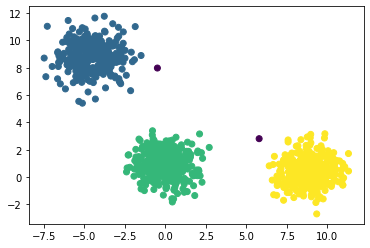

# kmeans--
## KMeans-- (K-Means minus minus) Pytorch implementation with GPU/CPU support

PyTorch implementation of the paper "k-means--: A unified approach to clustering and outlier detection" by Sanjay Chawla and Aristides Gionis.
If CUDA is enabled, the model can run on GPU.

K-Means-- is an extesion of k-means that performs simultaneously both clustering and outliers detection. It takes as input the number of clusters (k) and the number of outliers (l).

```python
from kmeansmm import KMeansMM
import torch
```


```python
from sklearn.datasets import make_blobs
import matplotlib.pyplot as plt

n_samples = 1000
X, y = make_blobs(n_samples=n_samples, random_state=1232)

y_pred = KMeansMM(n_clusters=3, l=2, max_iter=1000).fit_predict(torch.FloatTensor(X))

plt.scatter(X[:, 0], X[:, 1], c=y_pred.cpu())
```


    <matplotlib.collections.PathCollection at 0x7f442ca6ab38>


    

    


```python

```


